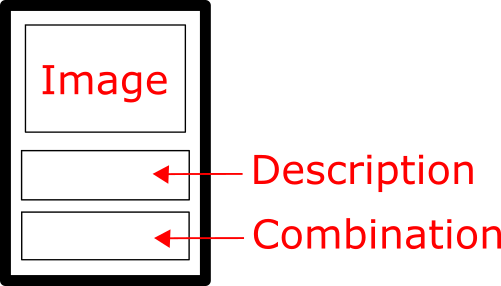
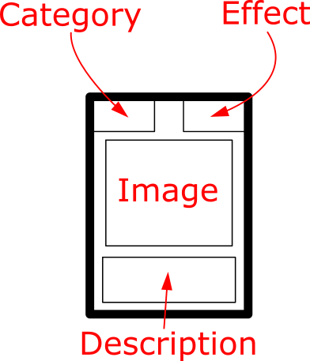

# Flotz v0.2

Note: This game is a work in progress and rules might change regularly

## Card Types

There are n types of cards in this game:
- Province Cards

- Ally Cards

- Influence Cards

- Regular Cards

## How to Play

### Setting up

Lay out Province and Ally Cards on the table with face up so all players can see them. Next, shuffle the rest of the cards and place the deck on the table.

Each player gets 4 cards. One of them begins the round.

### Playing 

When a player's round begins, if he has cards, he can use a combination of them to perform an action. 

If a player has cards he can play one or more cards with the following rules:
- The player can play any number of cards that have the same category (for example if they hold 3 religious cards and 1 propaganda card, they can play either the one propaganda or the 3 religious cards at the same time)
- If the player has a hand that would satisfy the requirements for a certain Ally Card, they can use those cards and gain that Ally Card. However, the effects of the cards do not have any effect. They can take the Ally Card from the table and place it next to them. They now gain the bonus effects of the Ally Card.
- They can place all four cards into the deck, shuffle it up and draw four cards. The player can not play any card in that round.
- If they have enough votes they can acquire a province. They take the province from the table and place it next to them.

If the player doesn't have a card, the player draws 4 new cards from the deck and their turn is over. He cannot acquire a province that round.
